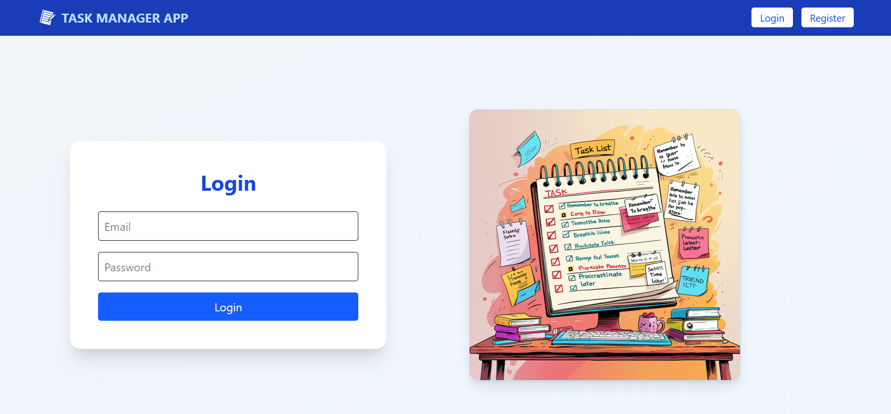
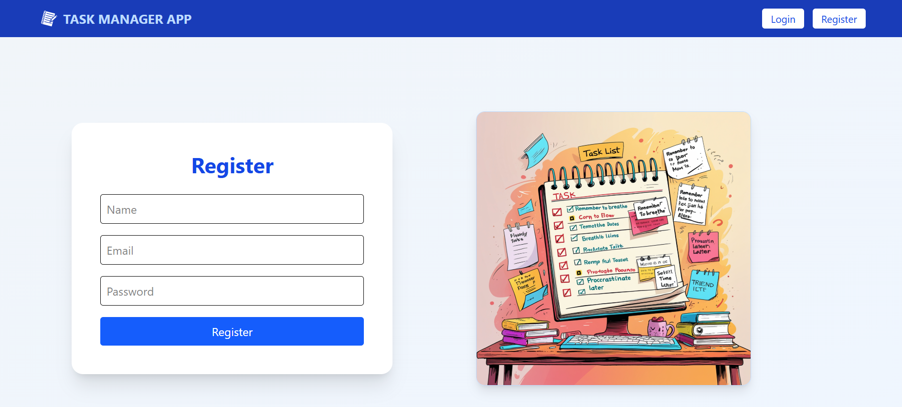
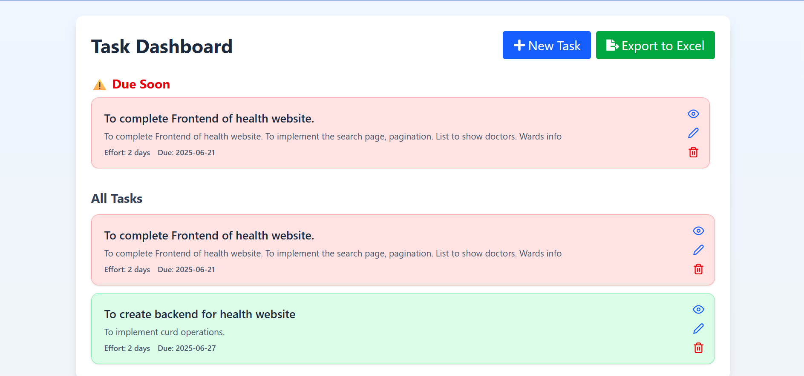
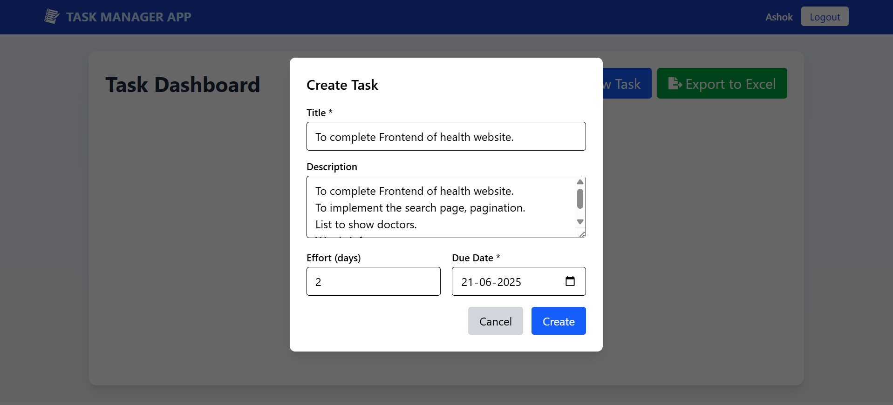
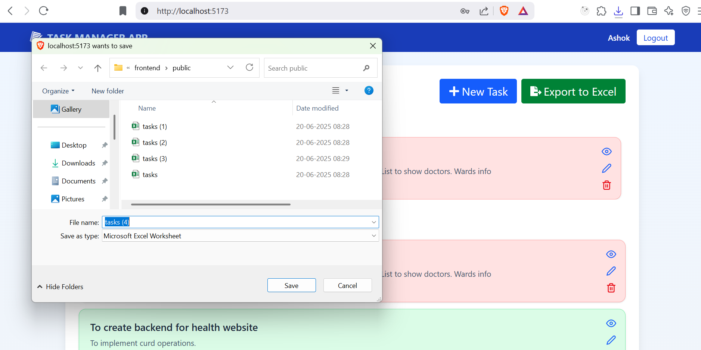

#  Task Manager App

A modern, responsive full-stack Task Management application built with:
-  **Authentication** (Node.js + Express)
-  **Frontend** in React with Tailwind CSS
-  **Tasks CRUD** and Excel Export via Django REST API
-  **SQLite** for backend storage
-  **React Toastify** for beautiful notifications

---

##  Features

- User registration and login
- Token-based authentication
- Create, edit, view, delete tasks
- Responsive dashboard UI with task prioritization
- Export tasks to `.xlsx`
- Toast notifications for feedback
- Modal-based task management
- Due Soon highlight

---

##  Project Structure

```
task-manager-app/
│
├── backend1/           # Node.js Auth server (Login/Register)
├── backend2/           # Django REST API for Tasks
├── frontend/           # React App with Tailwind CSS
└── README.md
```

---

## 🧰 Tech Stack

| Part        | Tech                             |
|-------------|----------------------------------|
| Frontend    | React, Tailwind CSS, React Icons, React Router, Toastify |
| Auth Backend| Node.js, Express, JWT            |
| Task Backend| Django, Django REST Framework, SQLite |
| Export      | `openpyxl`, `pandas`             |

---

## ⚙️ Setup Instructions

### 1️⃣ Clone the Repo

```bash
https://github.com/manohar12-max/task-manager-app.git
cd task-manager-app
```

---

### 2️⃣ Backend1: Node.js (Auth)

```bash
cd backend1
npm install
npm run dev   # Runs on http://localhost:5000
```

> Update `.env` with JWT_SECRET and PORT if needed.

---

### 3️⃣ Backend2: Django (Task API)

```bash
cd ../backend2
python -m venv venv
venv\Scripts\activate   

pip install -r requirements.txt
python manage.py migrate
python manage.py runserver  # Runs on http://localhost:8000
```

---

### 4️⃣ Frontend: React App

```bash
cd ../frontend
npm install
npm run dev   # Runs on http://localhost:5173
```
### 🔑 `.env` (Backend1 - Node)

```
PORT=5000
JWT_SECRET=task-manager-app
```
### 🔑 `.env` (Backend2 - Django)

```
JWT_SECRET=task-manager-app
```

---

## ✅ Usage

1. Register a new user
2. Login with valid credentials
3. Access the Dashboard
4. Add / Edit / View / Delete tasks
5. Export tasks to Excel file
6. Enjoy a smooth UI with toasts and responsiveness

## Screenshots

 
 
 
 
 


